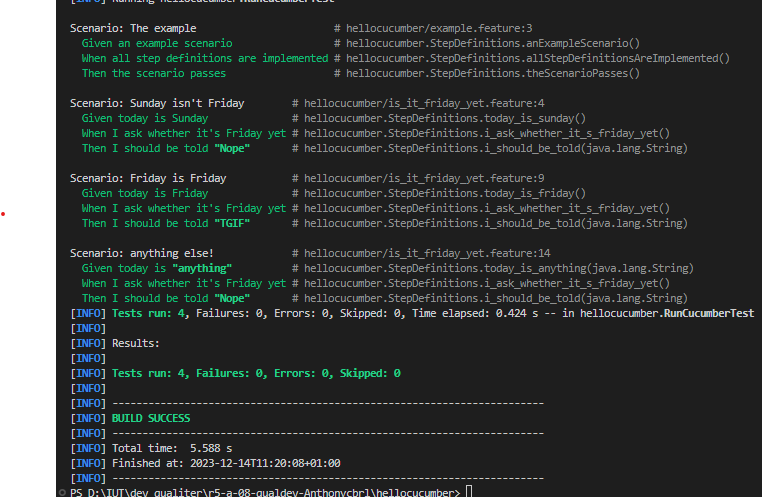

= R5.A.08 -- Dépôt pour les TPs
:icons: font
:MoSCoW: https://fr.wikipedia.org/wiki/M%C3%A9thode_MoSCoW[MoSCoW]

Ce dépôt concerne les rendus de mailto:A_changer@etu.univ-tlse2.fr[Jonh Doe].

== TP1

sceanario :

Feature: Is it Friday yet?
  Everybody wants to know when it's Friday

  Scenario: Sunday isn't Friday
    Given today is Sunday
    When I ask whether it's Friday yet
    Then I should be told "Nope"

  Scenario: Friday is Friday
    Given today is Friday
    When I ask whether it's Friday yet
    Then I should be told "TGIF"

  Scenario: anything else!
    Given today is "anything"
    When I ask whether it's Friday yet
    Then I should be told "Nope"

.Code pour repondre au sceanario:
[source,java]
---
 String actualAnswer = "";
    String expectedAnswer = "";

    static String isItFriday(String today) {
        return "Friday".equals(today) ? "TGIF" : "Nope";
    }

    @Given("today is Sunday")
    public void today_is_sunday() {
        this.actualAnswer = "Sunday";
    }

    @When("I ask whether it's Friday yet")
    public void i_ask_whether_it_s_friday_yet() {
        this.expectedAnswer = "Friday";
    }

    @Then("I should be told {string}")
    public void i_should_be_told(String string) {
        String result = isItFriday(actualAnswer);
        assertEquals(string, result);
    }

    @Given("today is Friday")
    public void today_is_friday() {
        this.actualAnswer = "Friday";
    }

    @Given("today is {string}")
    public void today_is_anything(String today) {
        this.actualAnswer = today;
    }

---

.Image de validation des tests

== TP2...
